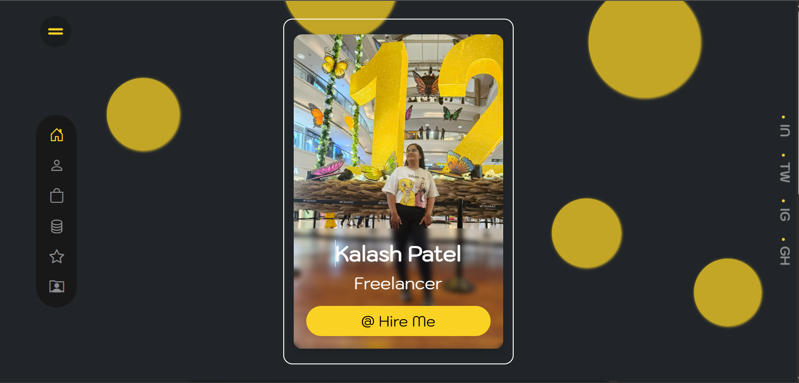
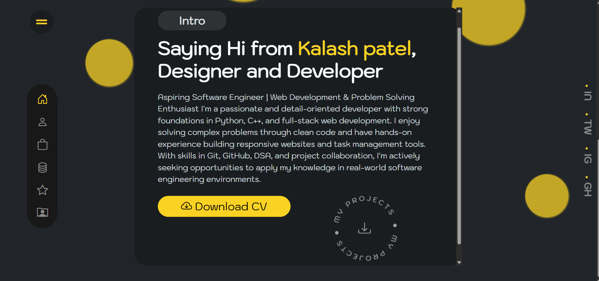
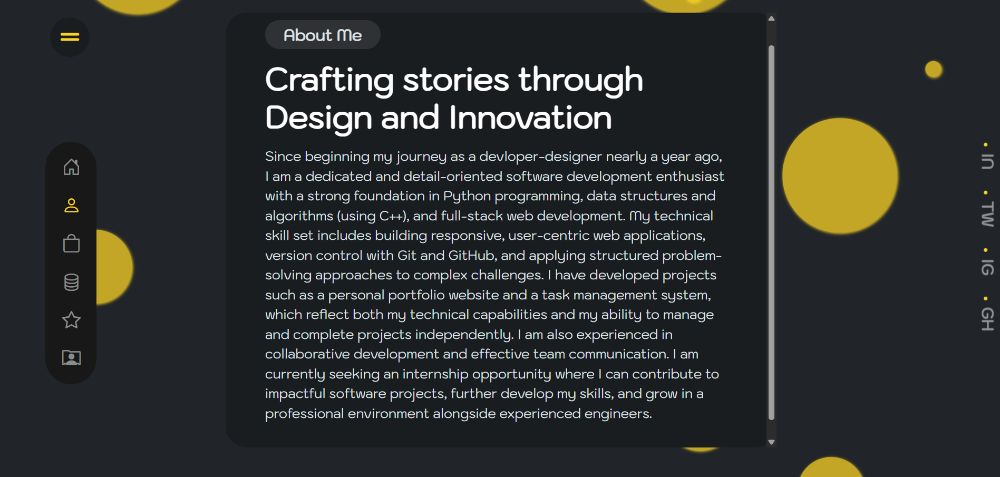
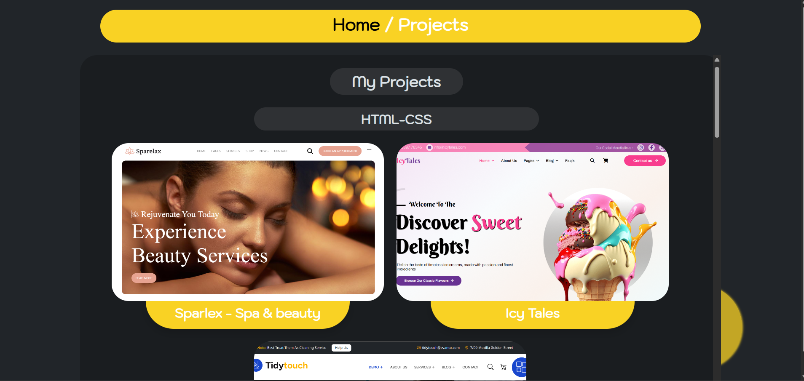

# 🌐 Kalash Patel — Personal Portfolio Website

A fully responsive personal portfolio website showcasing my skills, projects, services, and contact information as a Developer, Designer, and Freelancer.

🔗 **Live Demo:** [portfolio-six-jade-41.vercel.app](https://portfolio-six-jade-41.vercel.app/index.html)

---

## 📌 About

This portfolio was built to present my professional profile as an aspiring Software Engineer with a strong foundation in web development, Python, C++, and DSA. It highlights my education, experience, services, and technical skills in a clean and modern UI.

---

## 🚀 Features

- Responsive design across all devices (mobile-first)
- Smooth navigation with sections: Home, Profile, Resume, Services, Skills, Contact
- Downloadable CV link
- Social media links (LinkedIn, Twitter/X, Instagram, GitHub)
- Contact section with phone, email, and address
- Deployed on **Vercel**

---

## 🛠️ Tech Stack

| Technology     | Usage                          |
|----------------|-------------------------------|
| HTML5          | Structure & Markup             |
| CSS3           | Styling & Layout               |
| JavaScript     | Interactivity & DOM            |
| Tailwind CSS   | Utility-first CSS Framework    |
| Vercel         | Deployment & Hosting           |

---

## 📁 Project Structure

```
portfolio/
├── index.html
├── projects.html
├── assests/
│   └── images/
│       ├── sign-png.png
│       ├── about-intro/
│       │   └── circular_text.png
│       └── services/
│           └── ux-design.png
```

---

## 📚 Sections

- **Home** — Introduction and hero section
- **About** — Background, journey, and goals
- **Resume** — Education at IIT Jodhpur (AI & Data Science, 2027) and Red & White Multimedia Education; project experience
- **Services** — UI/UX Design, Frontend Development, JavaScript Programming, DSA
- **Skills** — HTML, CSS, Bootstrap, JavaScript, React.js, Figma, DSA (C++)
- **Contact** — Phone, email, and address

---

## 🎓 Education

- **B.Sc. in Information Technology** — IIT Jodhpur, Branch: AI & Data Science *(Expected 2027)*
- **Full Stack Web Development** — Red & White Multimedia Education, Surat

---

## 💼 Experience

**Independent Project Intern — Portfolio & Web Development Projects** *(Jan 2025 – Present)*
- Built a fully responsive Portfolio Website (HTML, CSS, JS, Tailwind CSS) deployed on Vercel
- Developed a Task Management System with task creation, status updates, and category filters
- Used Git & GitHub for version control and documentation

---

## 📬 Contact

| Platform  | Details |
|-----------|---------|
| 📧 Email  | kalashpatel606@gmail.com |
| 📞 Phone  | +91 63555 30644 |
| 📍 Address | 139, Shantisagar Society, Near L.P. Savani School, Adajan, Surat, Gujarat |
| 💼 LinkedIn | [kalash-patel-238945268](https://www.linkedin.com/in/kalash-patel-238945268/) |
| 🐦 Twitter/X | [@Kpatel86835616](https://x.com/Kpatel86835616) |
| 📸 Instagram | [@kalash__patel_16](https://www.instagram.com/kalash__patel_16/) |
| 🐙 GitHub | [Kalashpatel](https://github.com/Kalashpatel) |

---

## 🚀 Getting Started

To run this project locally:

```bash
# Clone the repository
git clone https://github.com/Kalashpatel/<your-repo-name>.git

# Navigate into the project folder
cd <your-repo-name>

# Open in browser
open index.html
```

---

## 📄 License

© 2024 Kalash Patel. All rights reserved.




